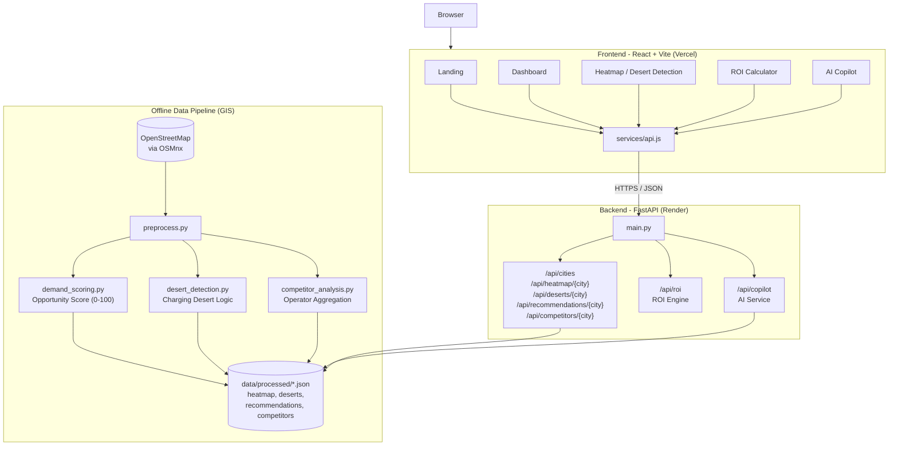

# ChargeWise AI

**An intelligence layer for EV charging infrastructure planning.** ChargeWise AI analyzes urban demand signals, existing charger density, and competitor presence to identify the highest-value locations for new EV charging stations, surface underserved "charging deserts," and forecast the financial return of a proposed site.

**Live Application:** [https://charge-wise-ai.vercel.app](https://charge-wise-ai.vercel.app)
**Backend API:** [https://chargewise-ai-lifp.onrender.com](https://chargewise-ai-lifp.onrender.com)

---

## Table of Contents

- [Overview](#overview)
- [Screenshots](#screenshots)
- [Core Features](#core-features)
- [Architecture](#architecture)
- [Tech Stack](#tech-stack)
- [Data Pipeline](#data-pipeline)
- [API Reference](#api-reference)
- [Project Structure](#project-structure)
- [Local Development](#local-development)
- [Deployment](#deployment)
- [Roadmap](#roadmap)

---

## Overview

EV adoption is outpacing charging infrastructure in most Indian metros, and capital allocation decisions for new charging stations are frequently made without rigorous spatial or financial analysis. ChargeWise AI addresses this by combining open geospatial data (points of interest, road networks, and existing charger locations) with a scoring engine to produce a data-driven view of where new infrastructure investment will perform best.

The current release is scoped to **Bengaluru, Karnataka**, with the underlying pipeline designed to extend to additional cities.

## Screenshots

### Landing Page
Marketing entry point summarizing the platform's value proposition and live grid status.


### Executive Dashboard
High-level KPIs — total opportunities, predicted revenue, charging deserts identified, and top site score — alongside a quarterly revenue forecast and infrastructure coverage analysis.


### Heatmap
Interactive Leaflet map rendering zone-level opportunity scores across the city, with a ranked list of heatmap zones and a quick path into the ROI calculator for any zone.


### Desert Detection
Identifies "charging deserts" — zones with high projected demand but no nearby charging infrastructure — and surfaces the top-scoring opportunity site with estimated ROI and payback period.


### ROI Calculator
A configurable financial model. Users adjust charger count, price per kWh, daily sessions, and setup cost to generate payback period, one-year ROI, investment grade, and a five-year revenue-versus-investment projection.


### AI Copilot
A conversational interface backed by the recommendation and desert-detection datasets, allowing natural-language questions about site selection, ROI, and underserved zones.


## Core Features

- **Opportunity Heatmap** — Zone-by-zone scoring (0–100) derived from point-of-interest density, existing charger gaps, and road accessibility.
- **Charging Desert Detection** — Flags high-demand zones with no nearby charging infrastructure within a defined radius.
- **Site Recommendations** — Ranked list of the highest-opportunity locations with projected daily sessions and ROI.
- **ROI Calculator** — Interactive financial model computing payback period, annual ROI, five-year revenue projection, and an investment grade.
- **Competitor Analysis** — Aggregates existing charging operators (e.g., Ather, Tata Power, BESCOM, ChargeZone) present in a given area.
- **AI Copilot** — Natural-language query interface over the same scoring and recommendation data.

## Architecture

ChargeWise AI is a two-tier application: a static single-page frontend and a stateless REST API backend, with a one-time offline GIS pipeline that produces the datasets the API serves.



**Design notes**

- The GIS pipeline (`gis/`) runs offline against OpenStreetMap data via OSMnx/GeoPandas and writes pre-computed JSON artifacts to `data/processed/`. This keeps the runtime API lightweight and avoids live geospatial computation on every request.
- The FastAPI backend is a thin read layer over those JSON artifacts, plus two computed endpoints: an ROI engine (`/api/roi`) and a rule-based AI Copilot (`/api/copilot`) that answers questions using the same recommendation and desert datasets.
- The frontend never talks to OpenStreetMap or performs geospatial computation itself — it only calls the backend's REST API, defined centrally in `frontend/src/services/api.js`.
- CORS is fully open on the backend (`allow_origins=["*"]`) to support the cross-origin Vercel-to-Render deployment topology.

## Tech Stack

**Frontend**
- React 18 with React Router for client-side routing
- Vite as the build tool and dev server
- Tailwind CSS for styling
- Leaflet / React-Leaflet for the interactive map
- Recharts for data visualization
- Framer Motion for page transitions

**Backend**
- FastAPI (Python) serving a REST API
- Pydantic for request/response validation
- Uvicorn as the ASGI server

**Geospatial / Data Processing**
- OSMnx for retrieving OpenStreetMap data
- GeoPandas and Shapely for spatial operations
- NetworkX for road-network graph analysis
- Pandas / NumPy for tabular processing

**Deployment**
- Frontend: Vercel
- Backend: Render

## Data Pipeline

The `gis/` directory contains the offline scoring pipeline:

| Script | Responsibility |
|---|---|
| `preprocess.py` | Orchestrates data retrieval from OpenStreetMap, geometry normalization, and JSON export to `data/processed/` |
| `demand_scoring.py` | Computes the 0–100 opportunity score from POI density, charger gap, and road accessibility |
| `desert_detection.py` | Flags a zone as a charging desert when its opportunity score is 90+ and no charger exists within 1.5 km |
| `competitor_analysis.py` | Normalizes and aggregates charging operator names present in the area |

Running `python gis/preprocess.py` regenerates `heatmap.json`, `deserts.json`, `recommendations.json`, and `competitors.json` under `data/processed/`, which the backend reads at request time.

## API Reference

Base URL: `https://chargewise-ai-lifp.onrender.com/api`

| Method | Endpoint | Description |
|---|---|---|
| GET | `/cities` | List of supported cities |
| GET | `/heatmap/{city}` | Zone-level opportunity scores for a city |
| GET | `/deserts/{city}` | Detected charging deserts for a city |
| GET | `/recommendations/{city}` | Ranked list of recommended sites |
| GET | `/competitors/{city}` | Aggregated competitor/operator presence |
| POST | `/roi` | Calculates ROI from supplied site parameters |
| POST | `/copilot` | Natural-language query against city data |

**Example — ROI calculation**

```http
POST /api/roi
Content-Type: application/json

{
  "chargers": 4,
  "price_per_kwh": 0.45,
  "sessions_per_day": 20,
  "avg_kwh_per_session": 18,
  "setup_cost_per_charger": 600000
}
```

**Example — AI Copilot query**

```http
POST /api/copilot
Content-Type: application/json

{
  "city": "bengaluru",
  "question": "What is the best ROI location?"
}
```

Root-level health endpoints are also exposed for monitoring: `GET /` and `GET /health`.

## Project Structure

```
ChargeWise/
├── backend/
│   ├── main.py                  # FastAPI app entrypoint
│   ├── requirements.txt
│   ├── routes/
│   │   ├── city.py              # Heatmap / deserts / recommendations / competitors
│   │   ├── roi.py                # ROI calculation endpoint
│   │   └── copilot.py            # AI Copilot endpoint
│   └── services/
│       ├── data_loader.py        # Reads processed JSON artifacts
│       ├── roi_engine.py         # ROI math
│       └── ai_service.py         # Copilot response logic
├── gis/
│   ├── preprocess.py             # OSM data retrieval + export pipeline
│   ├── demand_scoring.py         # Opportunity score model
│   ├── desert_detection.py       # Charging desert rule
│   └── competitor_analysis.py    # Operator aggregation
├── data/
│   ├── raw/                      # Raw OSM extracts
│   └── processed/                # Generated JSON consumed by the API
├── frontend/
│   ├── src/
│   │   ├── pages/                # Landing, Dashboard, Heatmap, AICopilot, ROICalculator, MapExplorer
│   │   ├── components/           # Navbar, KPIcard, ROIcalculator, AIcopilot, CompetitorPanel
│   │   ├── services/api.js       # Centralized backend API client
│   │   ├── App.jsx               # Route definitions
│   │   └── main.jsx
│   ├── index.html
│   ├── vite.config.js
│   └── tailwind.config.js
└── docs/
    └── demo_script.md
```

## Local Development

### Prerequisites
- Node.js 20.x
- Python 3.10+
- Yarn (package manager pinned via `packageManager` in `package.json`)

### Backend

```bash
cd ChargeWise/backend
python -m venv venv
source venv/bin/activate          # Windows: venv\Scripts\activate
pip install -r requirements.txt
uvicorn main:app --reload --port 8000
```

To regenerate the underlying datasets:

```bash
cd ChargeWise/gis
python preprocess.py
```

### Frontend

```bash
cd ChargeWise/frontend
yarn install
yarn dev
```

The Vite dev server runs on `http://localhost:5173` and proxies `/api` requests to `http://127.0.0.1:8000` (see `vite.config.js`). For production builds, `frontend/src/services/api.js` points directly at the deployed Render backend URL.

```bash
yarn build      # production build to dist/
yarn preview    # preview the production build locally
```

## Deployment

| Layer | Platform | URL |
|---|---|---|
| Frontend | Vercel | https://charge-wise-ai.vercel.app |
| Backend | Render | https://chargewise-ai-lifp.onrender.com |

- The frontend is deployed as a static Vite build on Vercel.
- The backend is deployed on Render as a standard Python web service running Uvicorn/FastAPI.
- Because the backend free-tier instance may spin down when idle, the first request after inactivity can take several seconds to respond while the service cold-starts.

## Roadmap

- Extend city coverage beyond Bengaluru
- Replace the rule-based Copilot with an LLM-backed reasoning layer over the same datasets
- Persist site-level analyses and user-submitted candidate locations
- Add authentication and role-based access for multi-tenant fleet operators
