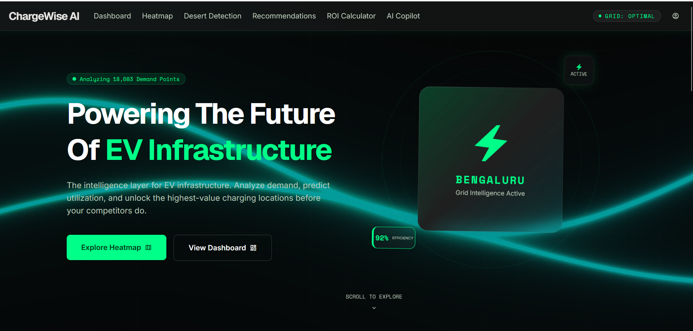
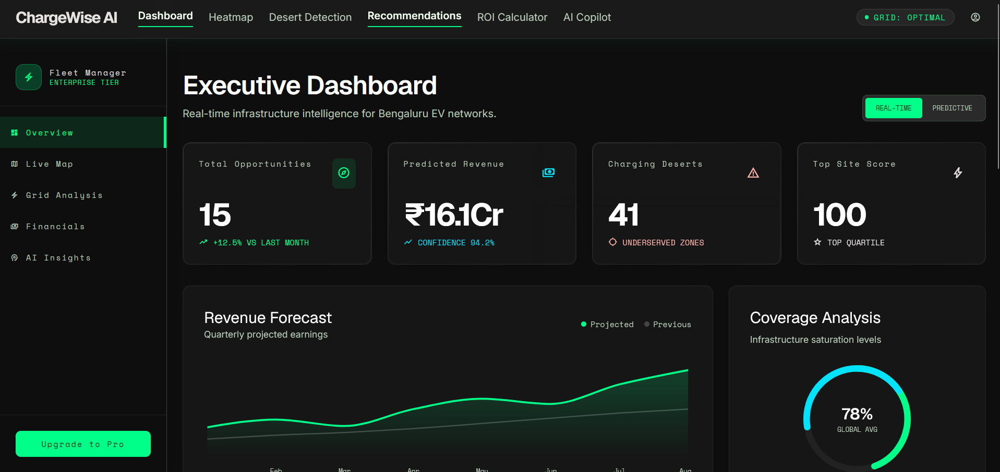
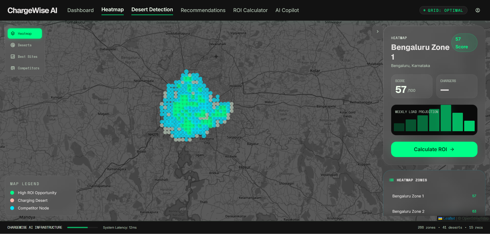
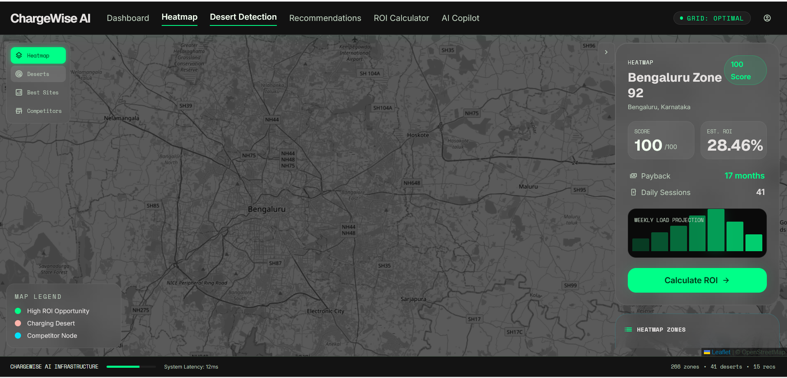
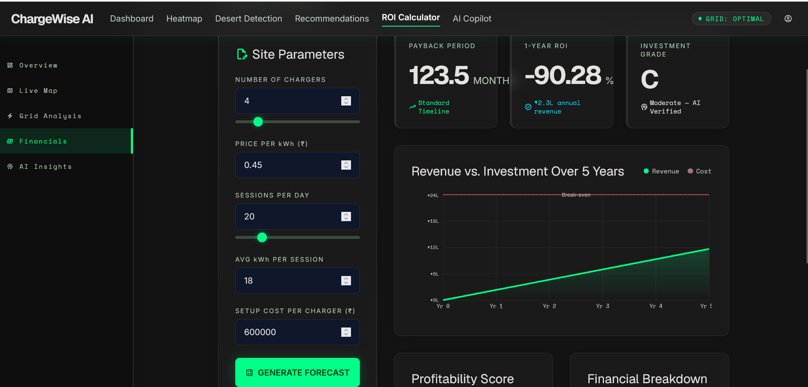
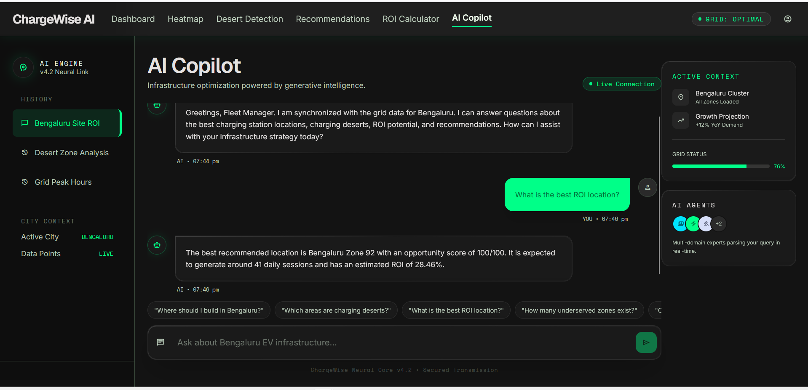
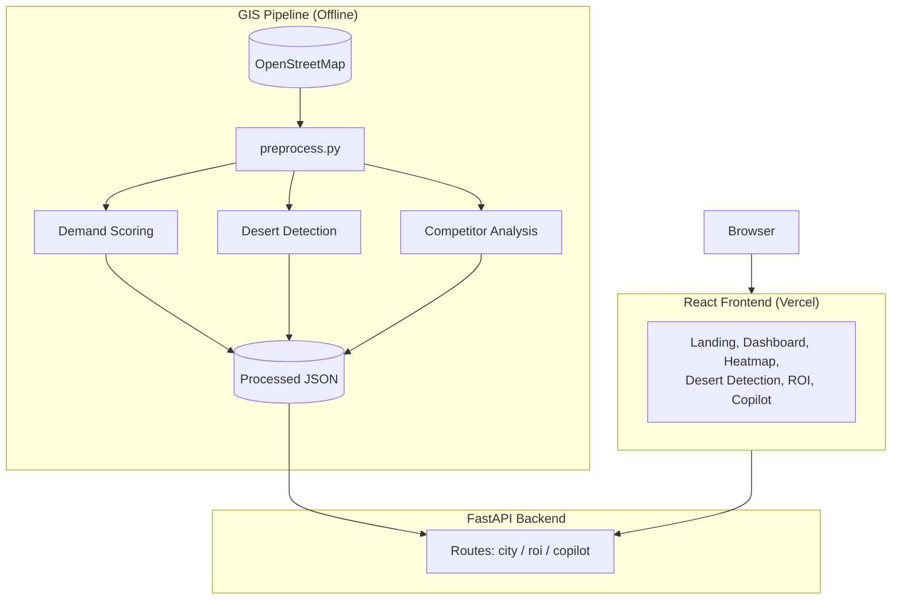

<div align="center">

# ChargeWise AI


**An intelligence layer for EV charging infrastructure planning.**

[Live Demo](https://charge-wise-ai.vercel.app)

</div>

---

## Overview

ChargeWise AI analyzes urban demand, existing charger density, and competitor presence to identify high-value EV charging locations, detect underserved "charging deserts," and forecast ROI for new sites. Currently scoped to Bengaluru, Karnataka.

## Screenshots

### Landing Page


### Executive Dashboard


### Heatmap


### Desert Detection


### ROI Calculator


### AI Copilot


## Core Features

- Opportunity heatmap with zone-level scoring (0–100)
- Charging desert detection for underserved zones
- Ranked site recommendations with projected sessions and ROI
- Interactive ROI calculator with payback period and 5-year forecast
- Competitor/operator presence analysis
- AI Copilot for natural-language queries over site data

## Architecture



## Tech Stack

**Frontend:** React, Vite, Tailwind CSS, React Router, Leaflet, Recharts, Framer Motion
**Backend:** FastAPI, Pydantic, Uvicorn
**Geospatial:** OSMnx, GeoPandas, Shapely, NetworkX, Pandas, NumPy
**Deployment:** Vercel (frontend)

## Data Pipeline

| Script | Responsibility |
|---|---|
| `preprocess.py` | OSM data retrieval and JSON export |
| `demand_scoring.py` | Opportunity score (0–100) |
| `desert_detection.py` | Charging desert detection logic |
| `competitor_analysis.py` | Operator aggregation |

## API Reference

| Method | Endpoint | Description |
|---|---|---|
| GET | `/api/cities` | List supported cities |
| GET | `/api/heatmap/{city}` | Zone-level opportunity scores |
| GET | `/api/deserts/{city}` | Detected charging deserts |
| GET | `/api/recommendations/{city}` | Ranked recommended sites |
| GET | `/api/competitors/{city}` | Competitor presence summary |
| POST | `/api/roi` | Calculate ROI for site parameters |
| POST | `/api/copilot` | Natural-language query over city data |

## Project Structure

```
ChargeWise/
├── backend/
│   ├── main.py
│   ├── routes/        # city, roi, copilot
│   └── services/      # data_loader, roi_engine, ai_service
├── gis/                # preprocessing & scoring scripts
├── data/processed/     # generated JSON datasets
└── frontend/
    └── src/
        ├── pages/
        ├── components/
        └── services/api.js
```

## Prerequisites

- Node.js 20.x and Yarn
- Python 3.10+

## Local Development

### Backend
```bash
cd ChargeWise/backend
python -m venv venv && source venv/bin/activate
pip install -r requirements.txt
uvicorn main:app --reload --port 8000
```

### Frontend
```bash
cd ChargeWise/frontend
yarn install
yarn dev
```

## Deployment

| Layer | Platform |
|---|---|
| Frontend | Vercel |
| Backend | Render |

The frontend is deployed as a static Vite build on Vercel. The backend runs as a FastAPI/Uvicorn service on Render.

## Future Enhancements

- Extend city coverage beyond Bengaluru
- Replace rule-based Copilot with an LLM-backed reasoning layer
- Add authentication and multi-tenant fleet operator support
